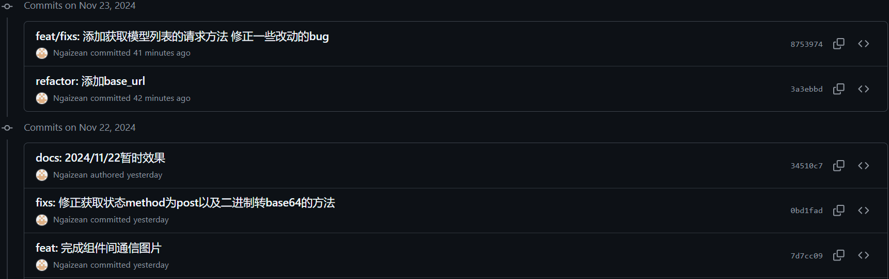

# 实验 10：【Alpha 4/4】项目 Alpha 冲刺

## 一、基本情况（15 分）

- 团队 ID：03
- 团队名称：今晚没番茄否则我会吼叫
- 项目博客和小组 GitHub 地址：[项目博客](https://no-tomatoes-tonight-or-id-scream.github.io/image-restorer/) [小组 GitHub 地址](https://github.com/no-tomatoes-tonight-or-id-scream/image-restorer) [Alpha 4/4 分支](https://github.com/no-tomatoes-tonight-or-id-scream/image-restorer/tree/alpha-4/4)
- 小组成员：洪佳荣、余毅臻、马俊飞、郝文轩

## 二、冲刺概况汇报（60 分）

### 洪佳荣

- 过去完成了哪些任务
  - 进一步带领小组完善用户体验设计
  - 完成进度汇报
- 文字描述

  进一步解决看板上的问题，完善布局。准备进度汇报的 PPT 和内容等。

- 展示 Gitee 当日代码/文档签入记录

  

- 接下来的计划

  继续完成看板上的剩余任务。

- 还剩下哪些任务

  暂未优化后端的数据库支持。

- 遇到了哪些困难

  前段知识较薄弱，有时候效果做不出来。

- 有哪些收获和疑问

  了解了一些现有的超分项目，对我们的项目有了更深的理解。

### 马俊飞

- 过去完成了哪些任务
  - 对页面中的功能进行了完善。
  - 完成自身的前端开发任务并进一步优化界面布局。
  - 将自己的一些工作合并到 main 分支中。
- 文字描述
  - 为页面图像处理结果返回后增加了处理后图像下载按钮以及返回上传按钮，并调整显示逻辑。
  - 将上述按钮调整到 Menu 中，并使用`grid`对页面布局进行了调整，使页面更加合理且可动态适应。
  - 增加了一些动态效果，使页面的交互性更强。
  - 消除了项目运行过程中出现的一些 warning
- 展示 Gitee 当日代码/文档签入记录
  
- 接下来的计划
  - 解决现有的 issue
  - 完成项目的下一轮迭代。
  - 对所负责的前端工作进行优化，并且与组员的工作进行调和
- 还剩下哪些任务
  - 菜单组件的模型列表显示滞后问题
  - 请求结果失败时重试一定次数，加入处理状态提示
  - 页面效果调整
- 遇到了哪些困难
  - 在前端开发的过程中，看似同样的效果可以从多种不同的方法实现，最终的效果的适应性也不同，起初时了解的组件不够多，导致后续需要进行相应调整。
  - 页面效果调整过程中有些效果会与其他组件产生冲突或者覆盖，需要进行相应的调整。
- 收获和疑问
  - 对项目的需求有了更进一步的了解，并据此对我们的开发工作进行了调整。
  - 对`vue`框架有了越来越多的了解，并对前端开发方面有了更加充分的了解。
  - 相同的效果可以有多种实现方法，如何选择最合适的方法是一个需要不断调整的过程。

### 郝文轩

- 过去完成了哪些任务
  - 对接前后端需求
  - 调整接口框架数据结构
- 文字描述
  在前后端基本功能实现之后，我们进一步对接前后端需求，调整接口框架数据结构
- 展示 Gitee 当日代码/文档签入记录
  
- 接下来的计划
  - 实现前后端整合
  - 继续实现主要降噪功能之外的其他功能方法
- 还剩下哪些任务
  - 测试接口
- 遇到了哪些困难
  - 对目标应用的机器学习算法底层代码掌握不够透彻
- 有哪些收获和疑问
  - 对前后端分离的开发有了进一步的实战经验

### 余毅臻

- 过去完成了哪些任务
  - 和后端开发人员对接，完成前后端的通信。
  - 完成自身的前端开发任务并进一步优化 UI 界面。
  - 合并前端开发项目的分支。
- 文字描述
  - 借助后端开发人员的接口文档，完成前后端通信的衔接，项目整体进入试运行。
  - 完成前端分配的开发任务——对比图像的组件和背景组件的设计。
  - 将前端项目的所有分支合并到主分支进行规整，并不断修正 Bug。
- 展示 Github 当日代码/文档签入记录
  
- 接下来的计划
  - 完成项目的下一轮迭代。
  - 主要着眼于更美观的 UI 设计。
  - 继续优化前端的业务逻辑。
- 还剩下哪些任务
  - 优化 UI 界面设计。
  - 优化前端业务逻辑。
- 遇到了哪些困难
  - 对后端衔接部分不熟悉，需要时间去研究。
- 收获和疑问
  - 学习了前后端衔接的方法，并熟悉掌握 UI 设计的样式微调。
  - 对项目的需求有进一步的了解，与团队成员的互相协作进一步磨合。

## 三、冲刺成果展示（25 分）

- 展示组内最新成果（可用图片、文字描述等任意形式，也可以是 B 站视频链接，不要贴代码）（15 分）
  1. 项目网站：[https://no-tomatoes-tonight-or-id-scream.github.io/image-restorer/](https://no-tomatoes-tonight-or-id-scream.github.io/image-restorer/)
     
  2. 项目看板：
  3. 前端示意图： 
- 站立会议合照（5 分）
  
- 会议时间、地点、内容记录（5 分）
  2024 年 11 月 28 日下午 16:00，于 58 工坊开始了本次会议。会议内容主要包括了下一步规划和看板任务的完善。由于郝文轩同学在外地无法赶回，故线上参会。
