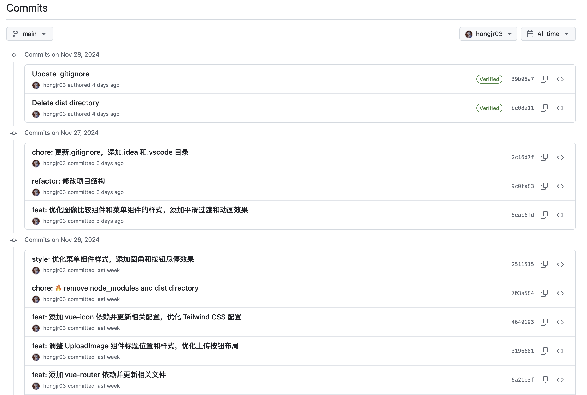
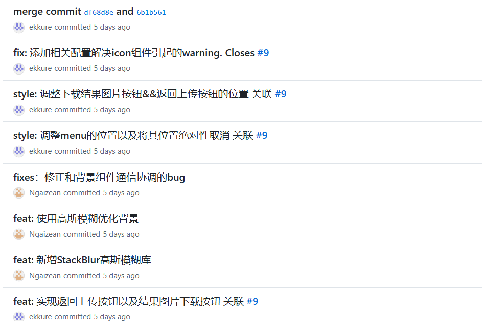
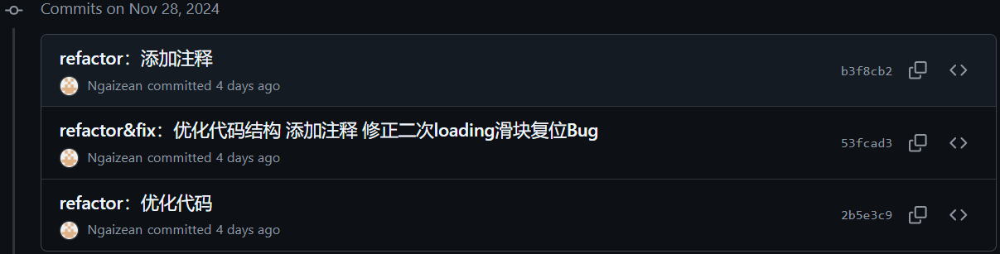
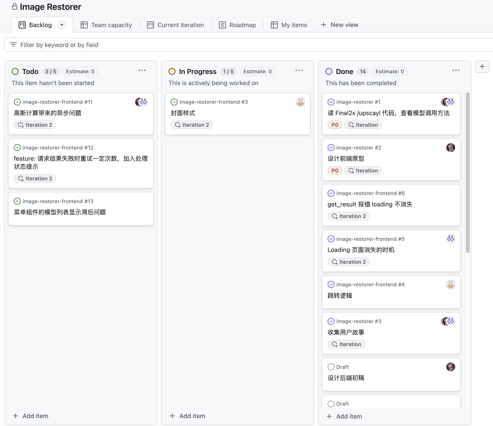
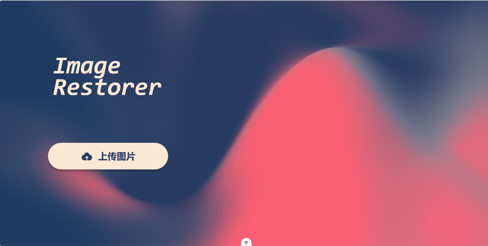
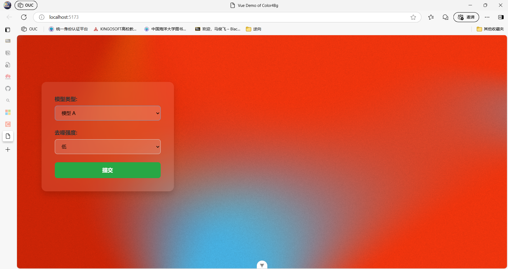
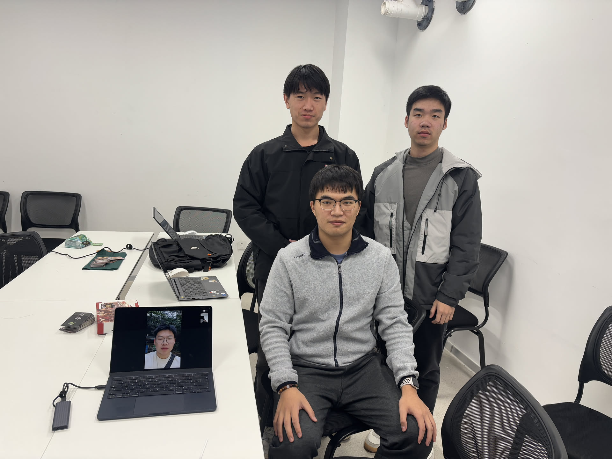

# 实验 10：【Alpha 4/4】项目 Alpha 冲刺

## 一、基本情况（15 分）

- 团队 ID：03
- 团队名称：今晚没番茄否则我会吼叫
- 项目博客和小组 GitHub 地址：[项目博客](https://no-tomatoes-tonight-or-id-scream.github.io/image-restorer/) [小组 GitHub 地址](https://github.com/no-tomatoes-tonight-or-id-scream/image-restorer) [Alpha 4/4 分支](https://github.com/no-tomatoes-tonight-or-id-scream/image-restorer/tree/alpha-4/4)
- 小组成员：洪佳荣、余毅臻、马俊飞、郝文轩

## 二、冲刺概况汇报（60 分）

### 洪佳荣

- 过去完成了哪些任务
  - 进一步带领小组完善用户体验设计
  - 完成进度汇报
- 文字描述

  进一步解决看板上的问题，完善布局。准备进度汇报的 PPT 和内容等。

- 展示 Gitee 当日代码/文档签入记录

  

- 接下来的计划

  继续完成看板上的剩余任务。

- 还剩下哪些任务

  暂未优化后端的数据库支持。

- 遇到了哪些困难

  前段知识较薄弱，有时候效果做不出来。

- 有哪些收获和疑问

  了解了一些现有的超分项目，对我们的项目有了更深的理解。

### 马俊飞

- 过去完成了哪些任务
  - 对页面中的功能进行了完善。
  - 完成自身的前端开发任务并进一步优化界面布局。
  - 将自己的一些工作合并到 main 分支中。
- 文字描述
  - 为页面图像处理结果返回后增加了处理后图像下载按钮以及返回上传按钮，并调整显示逻辑。
  - 将上述按钮调整到 Menu 中，并使用`grid`对页面布局进行了调整，使页面更加合理且可动态适应。
  - 增加了一些动态效果，使页面的交互性更强。
  - 消除了项目运行过程中出现的一些 warning
- 展示 Gitee 当日代码/文档签入记录
  
- 接下来的计划
  - 解决现有的 issue
  - 完成项目的下一轮迭代。
  - 对所负责的前端工作进行优化，并且与组员的工作进行调和
- 还剩下哪些任务
  - 菜单组件的模型列表显示滞后问题
  - 请求结果失败时重试一定次数，加入处理状态提示
  - 页面效果调整
- 遇到了哪些困难
  - 在前端开发的过程中，看似同样的效果可以从多种不同的方法实现，最终的效果的适应性也不同，起初时了解的组件不够多，导致后续需要进行相应调整。
  - 页面效果调整过程中有些效果会与其他组件产生冲突或者覆盖，需要进行相应的调整。
- 收获和疑问
  - 对项目的需求有了更进一步的了解，并据此对我们的开发工作进行了调整。
  - 对`vue`框架有了越来越多的了解，并对前端开发方面有了更加充分的了解。
  - 相同的效果可以有多种实现方法，如何选择最合适的方法是一个需要不断调整的过程。

### 郝文轩

- 过去完成了哪些任务
  
  + 辅助完成细节修缮
  + 测试样例生成脚本编写
- 文字描述
  项目整体框架已经基本完成，因此我在这周仅进行了辅助的工作，包括测试样例生成和文书部分
- 展示 Gitee 当日代码/文档签入记录
  
- 接下来的计划
  
  继续完成看板后续的任务
- 还剩下哪些任务
  
  + 后端数据库优化
  + 不同噪声样本
- 遇到了哪些困难
  
  噪声图样例生成效率太低，数据单一
- 有哪些收获和疑问
  - 对前后端分离的开发有了进一步的实战经验
  - foolbox使用更加熟练

### 余毅臻

- 过去完成了哪些任务
  - 对网页的背景进行进一步的优化
  - 修复一些在新增功能中暴露出的Bug
  - 搭建Vue-router功能，实现网页的跳转
- 文字描述
  - 过去的背景是静态的，只是选取五个颜色进行展示，不能很好适应图片展示时的过渡。因此新增一个功能：将图片缩小并使用高斯模糊化后选取五个像素点进行取色，形成一个新的背景，这样能够和图片的衔接比较自然
  - 修复了一些bug：程序中出现Vue2语法导致功能不能启用；路由通信不能直接传file类型文件，改用URL；图片上下两翼的阴影因遮罩层的剪裁而被隐藏；二次提交导致的通信失灵的问题等等
  - 用户点击提交后的加载页面，将其优化至图片容器中，而不是全屏覆盖
- 展示 Github 当日代码/文档签入记录
  
- 接下来的计划
  - 完成项目的下一轮迭代
  - 主要着眼于更美观的 UI 设计
  - 继续优化前端的业务逻辑
  - 可能会探讨多端部署的方案
- 还剩下哪些任务
  - 优化 UI 界面设计
  - 优化前端业务逻辑
- 遇到了哪些困难
  - 对前端的定位和容器的设计不了解，导致调整布局花费较较长时间
- 收获和疑问
  - 熟悉掌握 UI 设计的样式微调
  - 学会了如何使用Vue-router搭建网页的跳转路由
  - 与团队成员的互相协作进一步磨合

## 三、冲刺成果展示（25 分）

- 展示组内最新成果（可用图片、文字描述等任意形式，也可以是 B 站视频链接，不要贴代码）（15 分）
  1. 项目网站：[https://no-tomatoes-tonight-or-id-scream.github.io/image-restorer/](https://no-tomatoes-tonight-or-id-scream.github.io/image-restorer/)
     
  2. 项目看板：
  3. 前端示意图： 
- 站立会议合照（5 分）
  
- 会议时间、地点、内容记录（5 分）
  2024 年 11 月 28 日下午 16:00，于 58 工坊开始了本次会议。会议内容主要包括了下一步规划和看板任务的完善。由于郝文轩同学在外地无法赶回，故线上参会。
