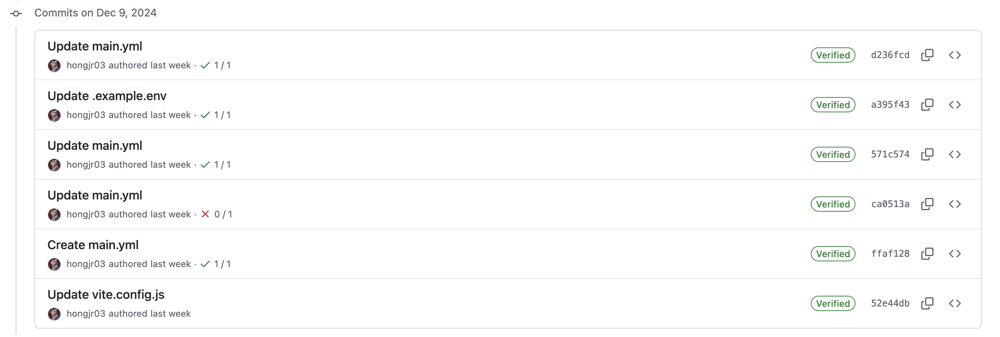
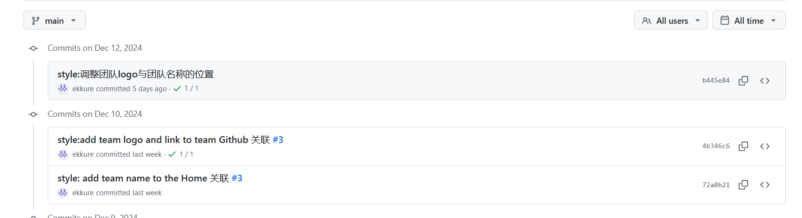
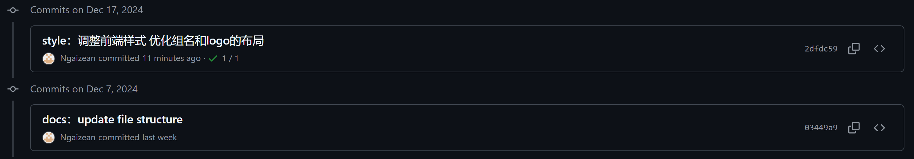
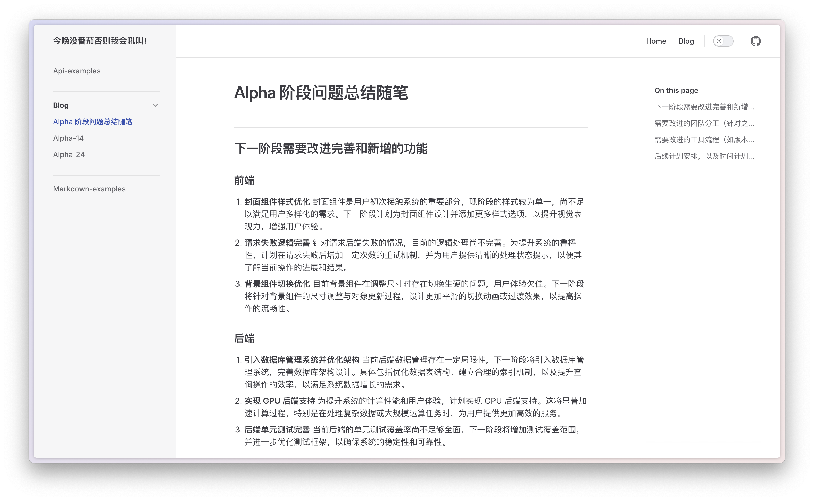
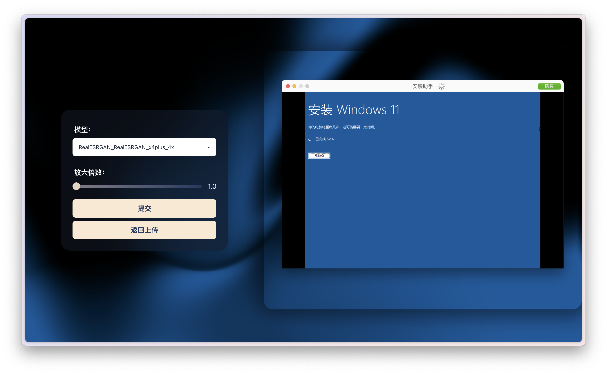
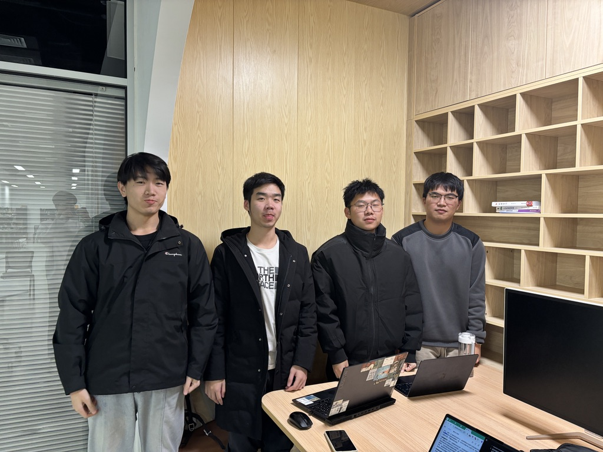

# 实验 11：【Beta 1/3】项目 Beta 冲刺

## 一、基本情况（15 分）

- 团队 ID：03
- 团队名称：今晚没番茄否则我会吼叫
- 项目博客和小组 GitHub 地址：[项目博客](https://no-tomatoes-tonight-or-id-scream.github.io/image-restorer/) [小组 GitHub 地址](https://github.com/no-tomatoes-tonight-or-id-scream/image-restorer) [Beta 1/3 分支](https://github.com/no-tomatoes-tonight-or-id-scream/image-restorer/tree/beta-1/3)
- 小组成员：洪佳荣、余毅臻、马俊飞、郝文轩

## 二、冲刺概况汇报（60 分）

### Alpha 阶段问题总结随笔

[Alpha 阶段问题总结随笔](https://no-tomatoes-tonight-or-id-scream.github.io/image-restorer/blog/Alpha%20%E9%98%B6%E6%AE%B5%E9%97%AE%E9%A2%98%E6%80%BB%E7%BB%93%E9%9A%8F%E7%AC%94.html)

### 洪佳荣

- 过去完成了哪些任务
  - 进一步带领小组完善用户体验设计
  - 完成 Alpha 阶段问题总结随笔
  - 完成进度汇报
- 文字描述

  进一步解决看板上的问题，完善布局，寻找测试用户进行评估。准备进度汇报的 PPT 和内容等。
  对前端项目使用 GitHub Action 和 GitHub Pages 更新了持续集成。

- 展示 Gitee 当日代码/文档签入记录

  

- 接下来的计划

  继续完成 Issue 中尚未解决的问题或提升。

- 还剩下哪些任务

  暂未优化后端的数据库支持。

- 遇到了哪些困难

  前段知识较薄弱，有时候效果做不出来。

- 有哪些收获和疑问

  了解了一些现有的超分项目，对我们的项目有了更深的理解。

### 马俊飞

- 过去完成了哪些任务
  - 对页面进行了风格性调整
- 文字描述
  - 在home页面中添加了团队logo以及团队名称
- 展示 Gitee 当日代码/文档签入记录
  
- 接下来的计划
  - 解决现有的 issue
  - 完成项目的下一轮迭代。
  - 对所负责的前端工作进行优化，并且与组员的工作进行调和
- 还剩下哪些任务
  - 菜单组件的模型列表显示滞后问题
  - 请求结果失败时重试一定次数，加入处理状态提示
  - 页面效果细节调整
- 遇到了哪些困难
  - 在前端开发的过程中，看似同样的效果可以从多种不同的方法实现，最终的效果的适应性也不同，起初时了解的组件不够多，导致后续需要进行相应调整。
  - 页面效果调整过程中有些效果会与其他组件产生冲突或者覆盖，需要进行相应的调整。
- 收获和疑问
  - 对项目的需求有了更进一步的了解，并据此对我们的开发工作进行了调整。
  - 对`vue`框架有了越来越多的了解，并对前端开发方面有了更加充分的了解。
  - 页面调整是一个持续的过程，直至合适协调。

### 郝文轩

- 过去完成了哪些任务
  
  + 辅助完成页面更新
  + 补充并润色Alpha总结随笔
  
- 文字描述
  完善测试样例生成脚本，并且对总结、汇报文书进行了辅助工作
  
- 展示 Gitee 当日代码/文档签入记录
  
  
- 接下来的计划
  
  继续完成看板后续的任务，思考可以进行进一步提升和更新的方向
  
- 还剩下哪些任务
  
  + 后端数据库优化
  + 补充完善技术文档
  
- 遇到了哪些困难
  
  噪声图样例生成效率太低，数据单一
  
- 有哪些收获和疑问
  
  进一步熟悉了foolbox的使用，对软件工程整体开发流程有了更深的理解

### 余毅臻

- 过去完成了哪些任务
  - 新增项目前端的文件结构描述
  - 修复一些在新增功能中暴露出的 Bug
  - 优化前端首页的关于团队Logo和名称的布局
- 文字描述
  - 在前端仓库的README中详细的描述了前端文件的组织架构
  - 将首页中的团队名称和Logo调整至右下角并优化一下样式
- 展示 Github 当日代码/文档签入记录
  
- 接下来的计划
  - 完成项目的下一轮迭代
  - 主要着眼于更美观的 UI 设计
  - 继续完善项目文档的撰写
  - 继续完善项目的部署
- 还剩下哪些任务
  - 优化 UI 界面设计
  - 维护项目
  - 撰写更详实的技术文档
- 遇到了哪些困难
  - 对前端的定位和容器的设计不了解，导致调整布局花费较较长时间
- 收获和疑问
  - 熟悉掌握 UI 设计的样式微调
  - 与团队成员的互相协作进一步磨合

## 三、冲刺成果展示（25 分）

- 展示组内最新成果（可用图片、文字描述等任意形式，也可以是 B 站视频链接，不要贴代码）（15 分）
  1. Alpha 阶段问题总结随笔
      
  2. 实现了背景颜色自适应
      
- 站立会议合照（5 分）
  
- 会议时间、地点、内容记录（5 分）
  2024 年 12 月 12 日下午 16:30，于 58 工坊开始了本次会议。会议内容主要包括了对 alpha 迭代的总结和下一步的项目计划。
