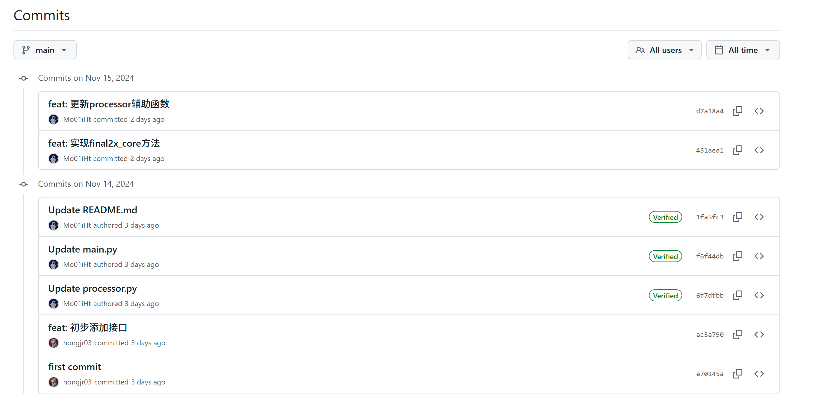
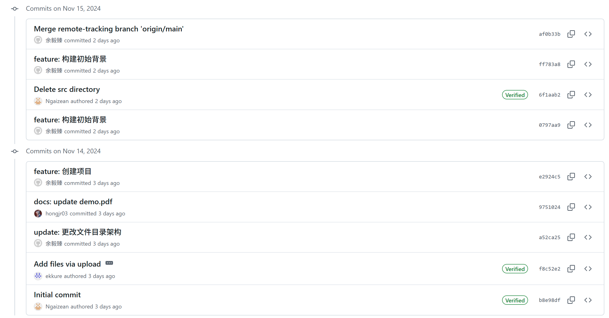
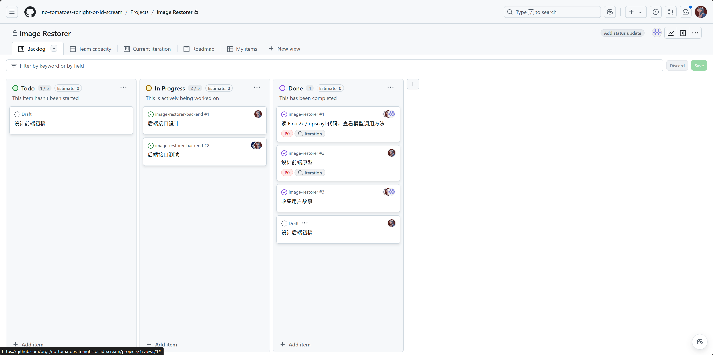
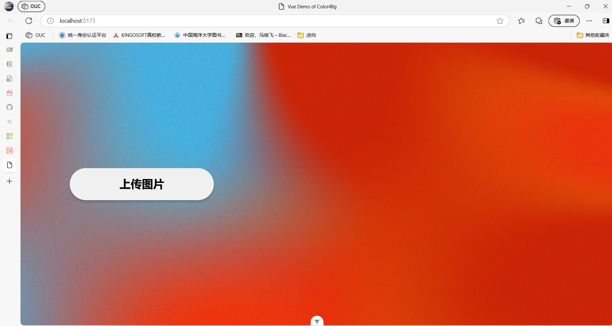

# 实验 9：【Alpha 3/4】项目 Alpha 冲刺

## 一、基本情况（15 分）

- 团队 ID：03
- 团队名称：今晚没番茄否则我会吼叫
- 项目博客和小组 GitHub 地址：[项目博客](https://no-tomatoes-tonight-or-id-scream.github.io/image-restorer/) [小组 GitHub 地址](https://github.com/no-tomatoes-tonight-or-id-scream/image-restorer) [Alpha 3/4 分支](https://github.com/no-tomatoes-tonight-or-id-scream/image-restorer/tree/alpha-3/4)
- 小组成员：洪佳荣、余毅臻、马俊飞、郝文轩

## 二、冲刺概况汇报（60 分）

### 洪佳荣

- 过去完成了哪些任务
    - 建立看板
    - 确定项目前后端技术栈、框架
    - 确定使用的机器学习模型
    - 带领团队制作前后端原型
- 文字描述

    将看板从 Notion 迁移至 GitHub Projects，方便团队成员查看任务进度。

    本周在 GitHub 找到两个开源的项目，作为我们项目的参考项目，分别是 [Final2x](https://github.com/Tohrusky/Final2x) 和 [Upscayl](https://github.com/upscayl/upscayl)。这两个项目都是基于一些现有的超分模型，通过超分实现通用的图像修复。项目的 GUI 均是使用 Electron 实现的，这对我们的项目有很大的参考意义。基于这两个项目我们开始了后端的研究和代码接口的设计。

    前端参考的是 [WeTransfer](https://wetransfer.com/) 的界面设计，这个网站的界面设计非常简洁，用户体验也很好。由于我们的项目功能也是相对比较简单的，所以我们决定参考这个网站的界面设计。
  
- 展示 Gitee 当日代码/文档签入记录
  
  
  
- 接下来的计划

  测试接口，完善后端代码。

- 还剩下哪些任务

  暂未优化后端的多用户支持和并行处理。

- 遇到了哪些困难

  需要一个后端设计规范，以便于团队成员之间的协作。

- 有哪些收获和疑问

  了解了一些现有的超分项目，对我们的项目有了更深的理解。

### 马俊飞

- 过去完成了哪些任务
    - 和项目组成员确定技术栈。
    - 完成项目原型的确定。
    - 开始着手对分配的任务进行开发。  
- 文字描述
    - 参与探讨了项目的技术栈，前端使用 Vue3 框架开发，后端使用 Flask 框架设计。
    - 参与确定了当前项目的简单初步原型
    - 所分配的任务是前端开发，进一步分工为图片上传和选项菜单，对此进行了初步的开发。
- 展示 Gitee 当日代码/文档签入记录
  
- 接下来的计划
    - 继续学习与目前的开发工作相关的内容
    - 了解后端组的接口需要并据此进行相应的设计
- 还剩下哪些任务
    - 对目前开发工作的优化和完善
    - 与组员工作内容的大致方向的对比，避免冲突太大
    - 考虑与后端对接时的接口设计
- 遇到了哪些困难
    - 对前端开发使用的`vue`框架缺乏了解，因此不断在网上学习
    - 对前端开发不熟悉，开发过程中比较缓慢
- 收获和疑问
    - 对项目的需求有了更进一步的了解，并了解了我们所使用的开发框架。
    - 对`vue`框架有了越来越多的了解，增长了我在前端开发方面的经验。
    - 让我认识到前端开发的难度，以及其中的一些乐趣 :)

### 郝文轩

- 过去完成了哪些任务
    - 对接前后端需求
    - 调整接口框架数据结构
- 文字描述
  在前后端基本功能实现之后，我们进一步对接前后端需求，调整接口框架数据结构
- 展示 Gitee 当日代码/文档签入记录
  
- 接下来的计划
    - 实现前后端整合
    - 继续实现主要降噪功能之外的其他功能方法
- 还剩下哪些任务
    - 测试接口
- 遇到了哪些困难
    - 对目标应用的机器学习算法底层代码掌握不够透彻
- 有哪些收获和疑问
    - 对前后端分离的开发有了进一步的实战经验

### 余毅臻

- 过去完成了哪些任务
    - 和项目组成员确定技术栈。
    - 完成项目原型的确定。
    - 开始着手对分配的任务进行开发。
- 文字描述
    - 和项目组成员在第二次迭代例行会议中探讨了本项目的技术栈，前端使用 Vue3 框架开发，后端使用 Flask 框架设计。
    - 在团队协作下，快速确定了当前项目的原型设计，使用 PowerPoint 对项目的原型进行简单的绘制。
    - 本次所分配的任务是前端，并对该分工任务和团队成员进一步细化分工。
- 展示 Github 当日代码/文档签入记录
  
- 接下来的计划
    - 完成项目的下一轮迭代。
    - 对整体前端的设计有个大致雏形的搭建。
    - 和后端设计组探讨接口参数的设计和使用。
- 还剩下哪些任务
    - 完成前端的开发任务。
    - 对项目进行迭代开发。
- 遇到了哪些困难
    - 对前端技术栈的使用生疏，导致初期开发困难。
- 收获和疑问
    - 明确了项目的原型设计，进一步强化对项目的了解，很清楚的知道要完成一个什么样的任务。
    - 对项目的需求有进一步的了解，与团队成员的互相协作进一步磨合。

## 三、冲刺成果展示（25 分）

- 展示组内最新成果（可用图片、文字描述等任意形式，也可以是 B 站视频链接，不要贴代码）（15 分）
    1. 项目网站：[https://no-tomatoes-tonight-or-id-scream.github.io/image-restorer/](https://no-tomatoes-tonight-or-id-scream.github.io/image-restorer/)
        
    2. 项目看板：
    3. 前端示意图： 
- 站立会议合照（5 分）
    
- 会议时间、地点、内容记录（5 分）
  2024 年 11 月 14 日晚上 20:00，于 58 工坊开始了本次会议。会议内容主要包括了前后端分工、前后端原型和参考项目的讨论，着手项目的下一轮迭代。
